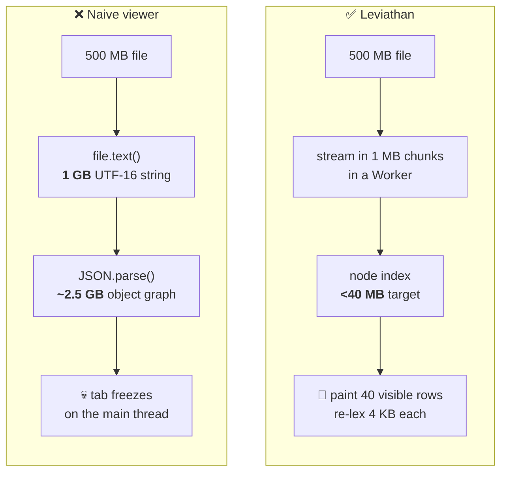
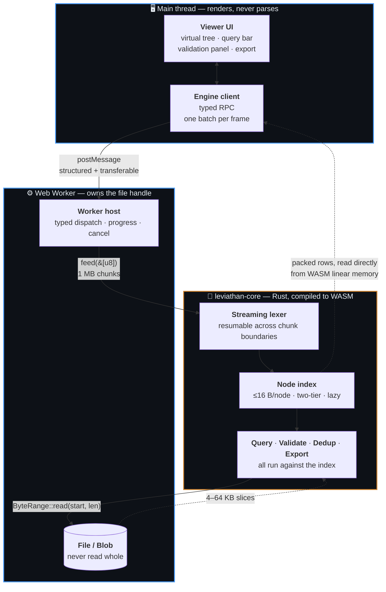

<div align="center">

# 🐋 Leviathan

**A JSON viewer that survives large files.**

Open multi-gigabyte JSON and NDJSON in your browser. No freezing, no upload, no server.

[](https://github.com/shadkhan/leviathan/actions/workflows/ci.yml)
[](#license)
[](crates/leviathan-core)

</div>

> [!WARNING]
> **Status: M1 — the engine works, the UI does not exist yet.** The streaming
> lexer, both index tiers, row materialization and the WASM boundary are built,
> measured and green in CI: a file opens, indexes in batches, and its rows cross
> into JavaScript. What is *not* built is the virtualized tree — the viewer page
> is still a self-check that lists rows and walks into one container at a time.
> Leviathan is not yet something you would install. See [Roadmap](#roadmap).

---

## The problem

Every JSON viewer in your browser — the built-in one, and every extension —
does the same thing:

```js
JSON.parse(await file.text())   // ← the tab is now gone
```

Two allocations kill it. `file.text()` holds the whole file as a UTF-16 string
(**2× the file size**), and `JSON.parse` builds an object graph that is
typically **3–10×** the file size again. A 500 MB file asks for several
gigabytes on the main thread, so the tab freezes, then dies.

The workarounds are all bad: `jq` in a terminal loses you the tree, online
viewers upload your data to someone else's server, and the good desktop tools
are abandoned or paid.

## The approach

Leviathan never parses the file into a value. It **indexes** it.

The index stores only what is needed to *find* things — where each node starts,
what kind it is, who its parent is. Key names, string values, and exact spans
are re-derived by re-lexing a few kilobytes at the moment a row is painted. A
4 KB re-scan costs microseconds; storing that same information for 10 M nodes
costs hundreds of megabytes. The trade is one-sided.



The file itself stays where it was — a `Blob` the Worker never reads whole. When
the core needs bytes it asks for a range, and the range is answered by
`Blob.slice`.

## Architecture



Three rules hold this together, and each is enforced by something that fails
rather than by a convention:

| Rule | How it's enforced |
|---|---|
| Parsing never happens on the main thread | The Worker compiles with `lib: WebWorker`; the UI has no parser to call |
| The core stays portable and publishable | [`scripts/check-layering.sh`](scripts/check-layering.sh) fails CI on any wasm/IO dependency |
| The bundle stays small | [`build.mjs`](packages/extension/build.mjs) fails the build above 150 KB gz |

## The core is a standalone library

`leviathan-core` is **sans-IO**: it never opens a file, never awaits, and does
not know what a `Blob` is. Bytes are pushed in; byte ranges are pulled back out
through a trait you implement. It has **zero dependencies**.

That is why the same crate runs unchanged in a Web Worker, a native CLI, and
(v2) an MCP server — and why it is published on its own rather than buried in an
extension:

| Package | Registry | What it is |
|---|---|---|
| [`leviathan-core`](crates/leviathan-core) | crates.io | The engine. Pure Rust, no dependencies. |
| [`@shadkhan/leviathan-core`](crates/leviathan-wasm) | npm | The same engine, as WASM + TypeScript types. |
| `leviathan-cli` | crates.io | Native harness: benchmarks, fixtures, fuzzing. |

## Quick start

**Prerequisites:** [Rust](https://rustup.rs) (stable), [wasm-pack](https://rustwasm.github.io/wasm-pack/installer/),
[Node](https://nodejs.org) 22+, and [pnpm](https://pnpm.io) 10+.

```sh
git clone https://github.com/shadkhan/leviathan
cd leviathan
pnpm install
pnpm build          # builds the WASM package, then the extension
```

Then load it in Chrome:

1. Open `chrome://extensions`
2. Turn on **Developer mode** (top right)
3. **Load unpacked** → select `packages/extension/dist`
4. Click the 🐋 toolbar icon

For iterating, `pnpm dev` rebuilds on change — reload the extension from
`chrome://extensions` to pick up each build.

See the **[User Manual](USER_MANUAL.md)** for what the viewer can currently do,
and for the full testing procedure.

## Testing

```sh
pnpm check      # everything below, in one command
```

Individually:

| Command | Proves |
|---|---|
| `cargo test --workspace` | Core logic: format detection, byte ranges, CLI arguments |
| `cargo test -p leviathan-core --test conformance` | RFC 8259 accept/reject over a committed corpus, every case at three chunk sizes |
| `leviathan conformance [DIR]` | The full [JSONTestSuite](https://github.com/nst/JSONTestSuite) corpus; non-zero exit on any disagreement |
| `leviathan fuzz --seconds N` | Mutation fuzzing for panics and chunk-boundary disagreements; reproducible from its seed |
| `cargo clippy --workspace --all-targets -- -D warnings` | No lint warnings anywhere |
| `cargo fmt --all --check` | Formatting |
| `bash scripts/check-layering.sh` | The core has no wasm/IO dependency and still builds for `wasm32` |
| `pnpm -C packages/extension smoke` | The built `.wasm` instantiates and its `Format` strings match the Rust tests |
| `pnpm typecheck` | Both TS projects — UI (`lib: DOM`) and Worker (`lib: WebWorker`) |
| `pnpm build` | Bundles, and enforces the 150 KB gz budget |

Not `cargo-fuzz`: it needs libFuzzer and a nightly toolchain and does not support
`x86_64-pc-windows-msvc`, so rather than make an exit criterion
platform-conditional the fuzzer is written the way the fixtures are — a seeded
xorshift, no dependencies, and the same sequence on any machine. It mutates valid
JSON (bit flips, deletions, truncations, duplicated spans) rather than only
generating noise, because uniformly random bytes are rejected within a few bytes
and exercise almost nothing.

Still to land: criterion benchmarks and Playwright end-to-end tests.

## Conformance

[JSONTestSuite](https://github.com/nst/JSONTestSuite), 318 cases, run by
`leviathan conformance`:

| Class | Meaning | Result |
|---|---|---|
| `y_` | must be accepted | **95 / 95** ✅ |
| `n_` | must be rejected | **185 / 188** — 3 documented deviations, below |
| `i_` | implementation-defined | 22 accepted, 13 rejected — every answer listed by the command |

The three deviations are one decision: **an empty file opens.** RFC 8259 requires
a JSON text to contain a value, so `` (empty), `" "` (a space) and a lone UTF-8
BOM are all invalid JSON — and Leviathan opens them anyway, reporting the format
as `empty` rather than refusing. Refusing to open a zero-byte file (a truncated
export, an interrupted download) is exactly the "it won't open" failure this
project exists to replace. The distinction being glossed over is real and belongs
to M3: *opening* an empty file should succeed, *validating* one should report
"no JSON value".

Deviations are declared in a table in the source and checked **both ways** — an
undocumented disagreement fails the run, and so does an exemption that no longer
applies, because a stale exemption is a false claim about the engine that nothing
else would catch.

A committed corpus of ~110 cases runs under plain `cargo test` with no network
and no submodule, **each case at three chunk sizes** (1 byte, 3 bytes, whole),
because a parser that is only correct when the input arrives in one piece is not
a streaming parser.

## Robustness

`leviathan fuzz --seconds 1800`, seed 1:

| | |
|---|---:|
| Cases | **1,969,106,501** (1.09 M/s) |
| — mutations of valid JSON | 1,476,843,412 |
| — random bytes | 492,263,089 |
| Still parsed as valid | 200,191,239 (10.2 %) |
| Panics | **0** |
| Chunk-size disagreements | **0** |

The invariant being checked is not "did it crash". The core is
`#![forbid(unsafe_code)]` with a state machine that never indexes unchecked, so a
panic was never the likely failure — what a *resumable* lexer can silently get
wrong is giving different answers depending on where the chunk boundary falls.
So every input runs at three chunk sizes and the verdicts must agree, while token
spans are checked to be ordered and inside the input and error positions to be
inside it with 1-based lines and columns. A caret pointing past end-of-file is
what would make M3's error locations worthless, and it would never show up as a
crash.

Three quarters of the corpus is mutated valid JSON — bit flips, deletions,
truncations, duplicated spans — because uniformly random bytes are rejected
within a few bytes and only ever exercise the first branch. The 10.2 % that still
parse is the figure that says the corpus is not all garbage, and a test asserts
it stays non-zero. Every run is reproducible from its seed, and a failure prints
the seed, the case number, and the offending bytes.

## Benchmarks

Reproducible via `leviathan-cli bench`, on a documented machine, against
generated fixtures. Rows fill in as milestones land; anything still `—` has not
been built, and no row is ever filled from an estimate.

| Fixture | Metric | Target | Naive `JSON.parse` | Measured |
|---|---|---|---|---|
| 500 MB NDJSON | Tier-1 index build | — | ✗ crashes | **0.35 s** warm · **1.07 s** cold |
| 500 MB NDJSON | Index size | < 40 MB | n/a | **14.2 MB** (2.8 %) ✅ |
| 500 MB NDJSON | Peak memory, indexed | < 400 MB | ✗ crashes | **22 MB** ✅ |
| 500 MB NDJSON | Lex throughput (native) | ≥ 200 MB/s | — | **248–327 MB/s** ✅ |
| 500 MB NDJSON | Parse + validate | — | ✗ crashes | **218 MB/s** |
| 500 MB NDJSON | Tokens/s (native) | — | — | **54–71 M/s** |
| 500 MB NDJSON | Whole-file find (native) | — | ✗ crashes | **466 ms** (1.1 GB/s) ✅ |
| **5 M-element array** | **Random row access** | **< 20 ms** | ✗ crashes | **65–119 µs** ✅ |
| 500 MB NDJSON | Random row access | < 20 ms | ✗ crashes | **0.74–1.09 ms** ✅ |
| 500 MB NDJSON | First rows painted | < 2 s | ✗ never | — |
| 500 MB NDJSON | Index throughput | ≥ 100 MB/s (WASM) | — | — |
| 500 MB NDJSON | First query results | < 500 ms | ✗ crashes | — |

*Machine: 8 × x86_64, Windows, `bench-native` profile. Figures are ranges over
repeated runs, not best-of. Two different spreads are folded into them: ±15 % of
ordinary scheduling noise, and — for any workload that reads the whole file —
up to **3×** depending on whether the fixture is resident in the OS page cache.
Seven identical runs of `index` spanned 345 ms to 1.07 s for that reason alone,
so whole-file rows are quoted cold-to-warm rather than as a single number
(`DEEP_REASONING.md` C49). What is exact is the `observed` column: the same
fixture always yields 108,133,846 tokens and 1,772,686 records, on every run, at
every chunk size, and in every batch configuration — that is the figure a
regression would actually surface in.*

Three results worth reading closely:

**Storing nothing was the right trade.** The index holds 8 bytes per node — no
kind, no length, no key text — so every field of every visible row is
reconstructed by going back to the file. That is the design's one load-bearing
assumption, and fetching row #4,499,955 of a five-million-element array takes
**65–119 µs cold**, against a 20 ms budget. Reading 50 rows costs *one*
byte-range read, not fifty, because siblings are contiguous in the file — which
matters far more in a Worker, where a `Blob.slice()` costs about a millisecond
whatever its size. (These are warm-file numbers: the OS page cache holds the
file, because building the index just read it.)

**Opening a file is six times cheaper than parsing it.** Tier-1 indexing of
NDJSON scans for newlines and never parses — which is exact rather than
heuristic, because JSON forbids raw control characters in strings, so a newline
can never occur inside a value. What matters is the ratio to the ceilings
measured on the same file in the same run, since all three move together with
the page cache (C49): counting newlines — the least work anything can do while
touching every byte — runs at 1.2 GB/s, and indexing runs at 1.4 GB/s, which is
to say *at* the ceiling, while a full parse-and-validate manages 216 MB/s. A
500 MB log file is therefore browsable in a third of a second, before any of it
has been validated.

**The index-size result is shape-dependent, and one shape misses.** 8 bytes per
child is 2.8 % of a record-shaped 500 MB file. For a flat array of small scalars
it is ~80 % of the file, because the elements themselves are only ~10 bytes.
Extrapolated, a 500 MB file of that shape would need ~400 MB of index and would
miss the criterion by an order of magnitude. Two mitigations are identified
(delta+varint offsets, or sparse indexing with bucket re-scan) and neither is
built yet — see `DEEP_REASONING.md` C29 rather than take the good number alone.

A pre-declared kill criterion exists: if a 500 MB file cannot be indexed under
800 MB peak after the documented fallbacks, the published claim drops to 250 MB
and the README says so. Deciding that in advance makes it arithmetic instead of
ego.

**Current build sizes** (these *are* measured):

| Artifact | Raw | Gzipped |
|---|---:|---:|
| `leviathan_wasm_bg.wasm` | 15,626 B | 7,247 B |
| All JS + CSS | 11,939 B | 5,038 B |
| | | **3 % of the 150 KB budget** |

## Roadmap

| | Milestone | Status |
|---|---|---|
| **M0** | Skeleton, WASM boundary, typed protocol, CI | ✅ code complete |
| **M1** | Streaming lexer + node index ← *the make-or-break phase* | ✅ lexer, grammar, both index tiers, row materialization, WASM boundary — all measured |
| **M2** | Virtualized tree renderer ← *next* | ⬜ |
| **M3** | Validation: byte-accurate errors, JSON Schema | ⬜ |
| **M4** | Query: JSONPath (RFC 9535) over the index | ⬜ |
| **M5** | Dedup: duplicate keys and elements, with locations | ⬜ |
| **M6** | Export: JSON / NDJSON / CSV, streamed | ⬜ |
| **M7** | Benchmarks, publish to crates.io + npm + Chrome Web Store | ⬜ |

v1 stops there. Not in v1: cloud sync, accounts, telemetry, JSON-LD/SEO
checking, or an AI-agent surface.

## Privacy

Your data never leaves your machine, and you do not have to take that on faith:

- The manifest requests **zero permissions** and **zero host permissions**
- The `.wasm` is a bundled asset — MV3 forbids remote code, and nothing is fetched
- There is no analytics, no telemetry, and no network code of any kind

## Design documents

This repository is written to be read. The reasoning is checked in, not implied:

| Document | What it holds |
|---|---|
| [`CLAUDE.md`](CLAUDE.md) | Product scope, non-goals, definition of done |
| [`SPEC.md`](SPEC.md) | The phased build plan, with exit criteria per milestone |
| [`DEEP_REASONING.md`](DEEP_REASONING.md) | Running log of core concepts — each with what it rules out and how it was validated |
| [`USER_MANUAL.md`](USER_MANUAL.md) | Installing, using, and testing |
| [`docs/adr/`](docs/adr/) | One architectural decision each, with the rejected alternatives and what it cost. Four written; [ADR-003](docs/adr/) waits on M2's measurement |

## License

Copyright © 2026 Shadab Khan.

Licensed under either of

- **MIT** — [`LICENSE-MIT`](LICENSE-MIT) · <https://opensource.org/licenses/MIT>
- **Apache License 2.0** — [`LICENSE-APACHE`](LICENSE-APACHE) · <https://www.apache.org/licenses/LICENSE-2.0>

at your option. This is the Rust ecosystem convention: MIT is short and
permissive, Apache-2.0 adds an explicit patent grant that some organisations
require before they can adopt a dependency. Offering both means neither is a
reason to say no.

Unless you explicitly state otherwise, any contribution intentionally submitted
for inclusion in this work shall be dual licensed as above, without any
additional terms or conditions.
