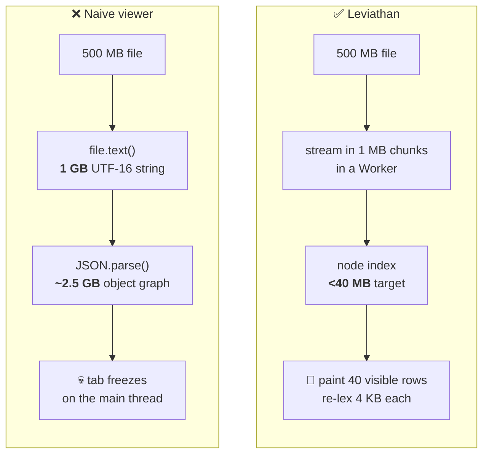
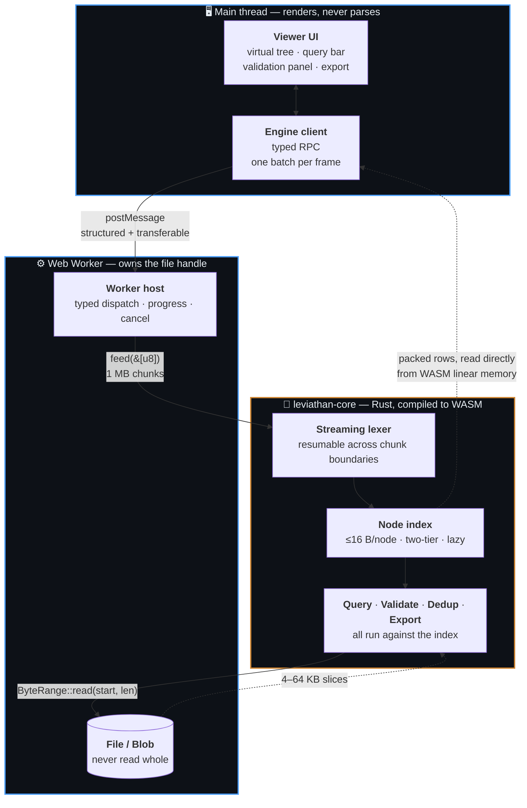

<div align="center">

# 🐋 Leviathan

**A JSON viewer that survives large files.**

Open multi-gigabyte JSON and NDJSON in your browser. No freezing, no upload, no server.

[](https://github.com/shadkhan/leviathan/actions/workflows/ci.yml)
[](#license)
[](crates/leviathan-core)

</div>

> [!WARNING]
> **Status: M0 — skeleton.** The Rust core, the WASM boundary, and the extension
> shell are built and green in CI. The streaming lexer, the node index, and the
> tree renderer are not written yet, so Leviathan cannot open a large file
> *today*. The benchmark table below is empty on purpose — no number goes in it
> until it has been measured. See [Roadmap](#roadmap).

---

## The problem

Every JSON viewer in your browser — the built-in one, and every extension —
does the same thing:

```js
JSON.parse(await file.text())   // ← the tab is now gone
```

Two allocations kill it. `file.text()` holds the whole file as a UTF-16 string
(**2× the file size**), and `JSON.parse` builds an object graph that is
typically **3–10×** the file size again. A 500 MB file asks for several
gigabytes on the main thread, so the tab freezes, then dies.

The workarounds are all bad: `jq` in a terminal loses you the tree, online
viewers upload your data to someone else's server, and the good desktop tools
are abandoned or paid.

## The approach

Leviathan never parses the file into a value. It **indexes** it.

The index stores only what is needed to *find* things — where each node starts,
what kind it is, who its parent is. Key names, string values, and exact spans
are re-derived by re-lexing a few kilobytes at the moment a row is painted. A
4 KB re-scan costs microseconds; storing that same information for 10 M nodes
costs hundreds of megabytes. The trade is one-sided.



The file itself stays where it was — a `Blob` the Worker never reads whole. When
the core needs bytes it asks for a range, and the range is answered by
`Blob.slice`.

## Architecture



Three rules hold this together, and each is enforced by something that fails
rather than by a convention:

| Rule | How it's enforced |
|---|---|
| Parsing never happens on the main thread | The Worker compiles with `lib: WebWorker`; the UI has no parser to call |
| The core stays portable and publishable | [`scripts/check-layering.sh`](scripts/check-layering.sh) fails CI on any wasm/IO dependency |
| The bundle stays small | [`build.mjs`](packages/extension/build.mjs) fails the build above 150 KB gz |

## The core is a standalone library

`leviathan-core` is **sans-IO**: it never opens a file, never awaits, and does
not know what a `Blob` is. Bytes are pushed in; byte ranges are pulled back out
through a trait you implement. It has **zero dependencies**.

That is why the same crate runs unchanged in a Web Worker, a native CLI, and
(v2) an MCP server — and why it is published on its own rather than buried in an
extension:

| Package | Registry | What it is |
|---|---|---|
| [`leviathan-core`](crates/leviathan-core) | crates.io | The engine. Pure Rust, no dependencies. |
| [`@shadkhan/leviathan-core`](crates/leviathan-wasm) | npm | The same engine, as WASM + TypeScript types. |
| `leviathan-cli` | crates.io | Native harness: benchmarks, fixtures, fuzzing. |

## Quick start

**Prerequisites:** [Rust](https://rustup.rs) (stable), [wasm-pack](https://rustwasm.github.io/wasm-pack/installer/),
[Node](https://nodejs.org) 22+, and [pnpm](https://pnpm.io) 10+.

```sh
git clone https://github.com/shadkhan/leviathan
cd leviathan
pnpm install
pnpm build          # builds the WASM package, then the extension
```

Then load it in Chrome:

1. Open `chrome://extensions`
2. Turn on **Developer mode** (top right)
3. **Load unpacked** → select `packages/extension/dist`
4. Click the 🐋 toolbar icon

For iterating, `pnpm dev` rebuilds on change — reload the extension from
`chrome://extensions` to pick up each build.

See the **[User Manual](USER_MANUAL.md)** for what the viewer can currently do,
and for the full testing procedure.

## Testing

```sh
pnpm check      # everything below, in one command
```

Individually:

| Command | Proves |
|---|---|
| `cargo test --workspace` | Core logic: format detection, byte ranges, CLI arguments |
| `cargo clippy --workspace --all-targets -- -D warnings` | No lint warnings anywhere |
| `cargo fmt --all --check` | Formatting |
| `bash scripts/check-layering.sh` | The core has no wasm/IO dependency and still builds for `wasm32` |
| `pnpm -C packages/extension smoke` | The built `.wasm` instantiates and its `Format` strings match the Rust tests |
| `pnpm typecheck` | Both TS projects — UI (`lib: DOM`) and Worker (`lib: WebWorker`) |
| `pnpm build` | Bundles, and enforces the 150 KB gz budget |

Landing with M1: JSONTestSuite conformance, `cargo-fuzz` on the lexer, criterion
benchmarks, and Playwright end-to-end tests.

## Benchmarks

Reproducible via `leviathan-cli bench`, on a documented machine, against
generated fixtures. Rows fill in as milestones land; anything still `—` has not
been built, and no row is ever filled from an estimate.

| Fixture | Metric | Target | Naive `JSON.parse` | Measured |
|---|---|---|---|---|
| 500 MB NDJSON | Tier-1 index build | — | ✗ crashes | **0.39–0.95 s** |
| 500 MB NDJSON | Index size | < 40 MB | n/a | **14.2 MB** (2.8 %) ✅ |
| 500 MB NDJSON | Peak memory, indexed | < 400 MB | ✗ crashes | **22 MB** ✅ |
| 500 MB NDJSON | Lex throughput (native) | ≥ 200 MB/s | — | **248–327 MB/s** ✅ |
| 500 MB NDJSON | Parse + validate | — | ✗ crashes | **218 MB/s** |
| 500 MB NDJSON | Tokens/s (native) | — | — | **54–71 M/s** |
| **5 M-element array** | **Random row access** | **< 20 ms** | ✗ crashes | **65–119 µs** ✅ |
| 500 MB NDJSON | Random row access | < 20 ms | ✗ crashes | **0.74–1.09 ms** ✅ |
| 500 MB NDJSON | First rows painted | < 2 s | ✗ never | — |
| 500 MB NDJSON | Index throughput | ≥ 100 MB/s (WASM) | — | — |
| 500 MB NDJSON | First query results | < 500 ms | ✗ crashes | — |

*Machine: 8 × x86_64, Windows, `bench-native` profile. Figures are ranges over
repeated runs, not best-of — spread on a desktop OS is ±15 %. What is exact is
the `observed` column: the same fixture always yields 108,133,846 tokens and
1,772,686 records, on every run and at every chunk size, and that is the figure a
regression would actually surface in.*

Three results worth reading closely:

**Storing nothing was the right trade.** The index holds 8 bytes per node — no
kind, no length, no key text — so every field of every visible row is
reconstructed by going back to the file. That is the design's one load-bearing
assumption, and fetching row #4,499,955 of a five-million-element array takes
**65–119 µs cold**, against a 20 ms budget. Reading 50 rows costs *one*
byte-range read, not fifty, because siblings are contiguous in the file — which
matters far more in a Worker, where a `Blob.slice()` costs about a millisecond
whatever its size. (These are warm-file numbers: the OS page cache holds the
file, because building the index just read it.)

**Opening a file is six times cheaper than parsing it.** Tier-1 indexing of
NDJSON scans for newlines and never parses — which is exact rather than
heuristic, because JSON forbids raw control characters in strings, so a newline
can never occur inside a value. Against ceilings on the same file (streaming and
touching nothing: 466 MB/s; counting newlines: 1.2 GB/s), indexing runs at
1.3 GB/s — *at* the memory-bandwidth ceiling — while a full parse-and-validate
runs at 218 MB/s. A 500 MB log file is therefore browsable in under half a
second, before any of it has been validated.

**The index-size result is shape-dependent, and one shape misses.** 8 bytes per
child is 2.8 % of a record-shaped 500 MB file. For a flat array of small scalars
it is ~80 % of the file, because the elements themselves are only ~10 bytes.
Extrapolated, a 500 MB file of that shape would need ~400 MB of index and would
miss the criterion by an order of magnitude. Two mitigations are identified
(delta+varint offsets, or sparse indexing with bucket re-scan) and neither is
built yet — see `DEEP_REASONING.md` C29 rather than take the good number alone.

A pre-declared kill criterion exists: if a 500 MB file cannot be indexed under
800 MB peak after the documented fallbacks, the published claim drops to 250 MB
and the README says so. Deciding that in advance makes it arithmetic instead of
ego.

**Current build sizes** (these *are* measured):

| Artifact | Raw | Gzipped |
|---|---:|---:|
| `leviathan_wasm_bg.wasm` | 15,626 B | 7,247 B |
| All JS + CSS | 11,939 B | 5,038 B |
| | | **3 % of the 150 KB budget** |

## Roadmap

| | Milestone | Status |
|---|---|---|
| **M0** | Skeleton, WASM boundary, typed protocol, CI | ✅ code complete |
| **M1** | Streaming lexer + node index ← *the make-or-break phase* | 🟡 lexer, grammar, tier-1 index, row materialization done; tier-2 + WASM next |
| **M2** | Virtualized tree renderer | ⬜ |
| **M3** | Validation: byte-accurate errors, JSON Schema | ⬜ |
| **M4** | Query: JSONPath (RFC 9535) over the index | ⬜ |
| **M5** | Dedup: duplicate keys and elements, with locations | ⬜ |
| **M6** | Export: JSON / NDJSON / CSV, streamed | ⬜ |
| **M7** | Benchmarks, publish to crates.io + npm + Chrome Web Store | ⬜ |

v1 stops there. Not in v1: cloud sync, accounts, telemetry, JSON-LD/SEO
checking, or an AI-agent surface.

## Privacy

Your data never leaves your machine, and you do not have to take that on faith:

- The manifest requests **zero permissions** and **zero host permissions**
- The `.wasm` is a bundled asset — MV3 forbids remote code, and nothing is fetched
- There is no analytics, no telemetry, and no network code of any kind

## Design documents

This repository is written to be read. The reasoning is checked in, not implied:

| Document | What it holds |
|---|---|
| [`CLAUDE.md`](CLAUDE.md) | Product scope, non-goals, definition of done |
| [`SPEC.md`](SPEC.md) | The phased build plan, with exit criteria per milestone |
| [`DEEP_REASONING.md`](DEEP_REASONING.md) | Running log of core concepts — each with what it rules out and how it was validated |
| [`USER_MANUAL.md`](USER_MANUAL.md) | Installing, using, and testing |
| `docs/adr/` | One architectural decision each, written at the phase that closes it |

## License

Copyright © 2026 Shadab Khan.

Licensed under either of

- **MIT** — [`LICENSE-MIT`](LICENSE-MIT) · <https://opensource.org/licenses/MIT>
- **Apache License 2.0** — [`LICENSE-APACHE`](LICENSE-APACHE) · <https://www.apache.org/licenses/LICENSE-2.0>

at your option. This is the Rust ecosystem convention: MIT is short and
permissive, Apache-2.0 adds an explicit patent grant that some organisations
require before they can adopt a dependency. Offering both means neither is a
reason to say no.

Unless you explicitly state otherwise, any contribution intentionally submitted
for inclusion in this work shall be dual licensed as above, without any
additional terms or conditions.
