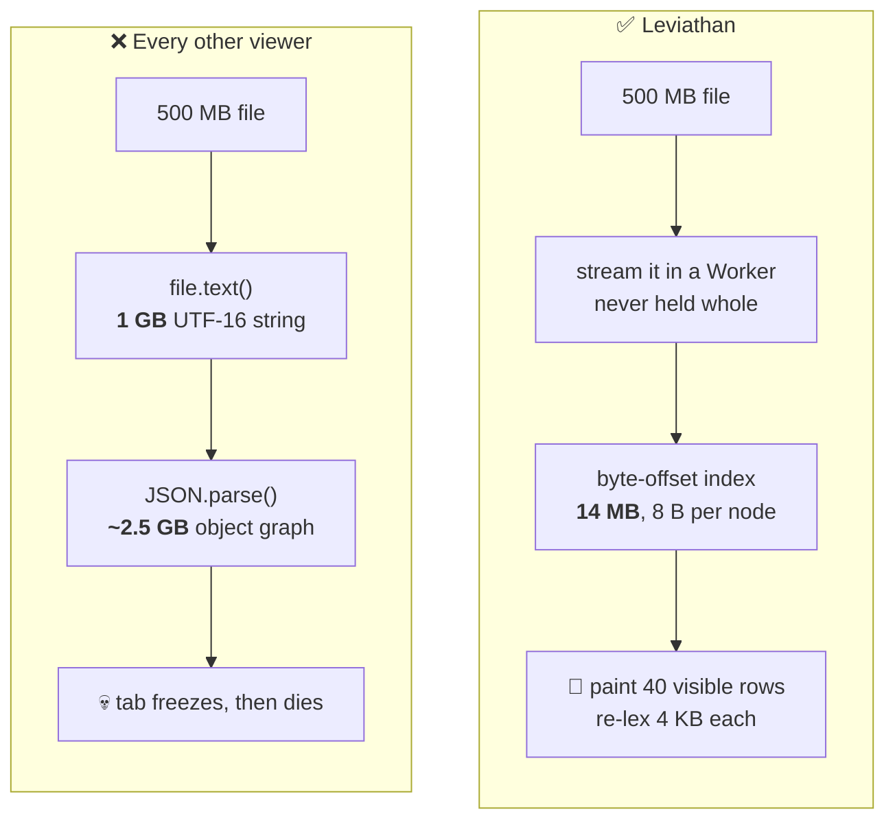
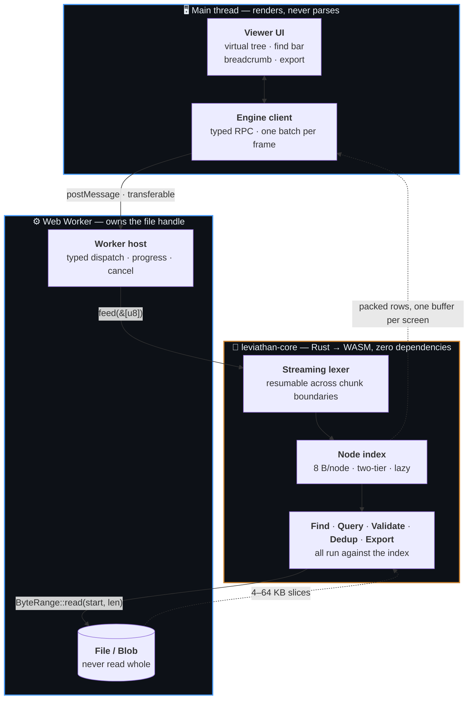
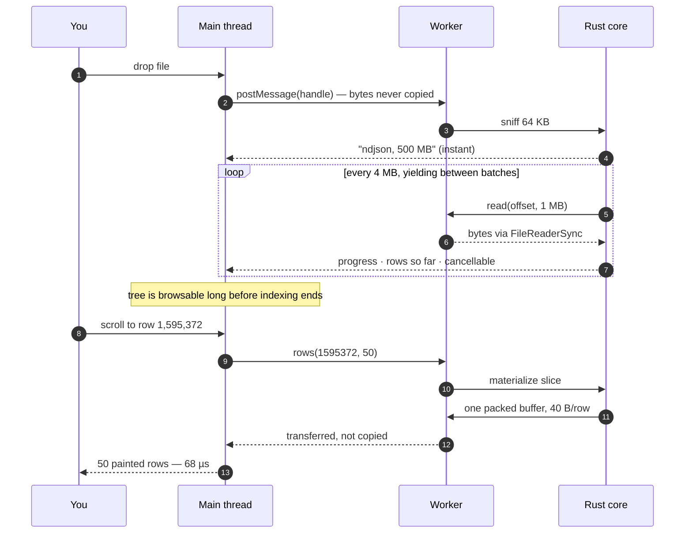

<div align="center">

# 🐋 Leviathan

**A JSON viewer that survives large files.**

Open multi-gigabyte JSON and NDJSON in your browser.
No freezing, no upload, no server.

[](https://github.com/shadkhan/leviathan/actions/workflows/ci.yml)
[](#license)
[](crates/leviathan-core)
[](#testing)

</div>

> [!WARNING]
> **Status: M7 next — every feature is built.** A 500 MB NDJSON file paints its
> first rows in **141 ms**, indexes at **140 MB/s** in WASM, scrolls at a median
> **16.6 ms** per frame with zero long tasks, answers `@.level == "error"` over
> 1.77 M records in **8.7 s**, checks 24.8 M keys for duplicates in **6.5 s**,
> and writes itself back out in **7.7 s** — all while staying interactive, and
> all in **22 MB**. One criterion is not met: 0.7 % of frames exceed 32 ms
> ([details](#numbers)). What remains is publishing. See the [roadmap](#roadmap).

---

## The problem

Every JSON viewer in your browser does the same thing:

```js
JSON.parse(await file.text())   // ← the tab is now gone
```

`file.text()` holds the whole file as a UTF-16 string (**2×** its size), and
`JSON.parse` builds an object graph typically **3–10×** its size again. A 500 MB
file asks for several gigabytes on the main thread.



**Leviathan never parses the file into a value — it indexes it.** The index
stores only where things start. Key names, values and spans are re-derived by
re-lexing a few kilobytes at the moment a row is painted: microseconds each,
against hundreds of megabytes to store them.

## Features

| | Feature | Lands in |
|---|---|---|
| 📂 | **Load** — drag-and-drop, file picker, folder, paste. JSON and NDJSON auto-detected | M2 |
| 🧭 | **Navigate** — go to a row, a byte offset, or a path pasted back from *Copy path* | M2 |
| 🌲 | **View** — virtualized tree, breadcrumb, full keyboard navigation, dark mode | M2 |
| 🔍 | **Find** — literal search streamed over the *whole file*, not just what's on screen | M2 |
| ✅ | **Validate** — byte/line/column-accurate errors, jump to the break, JSON Schema | M3 |
| 🧭 | **Filter** — `@.status == "error" && @.latency_ms > 1000`, evaluated against the index, results streamed | M4 |
| 🧬 | **Dedup** — duplicate keys and elements, reported with **both** locations | M5 |
| 📤 | **Export** — JSON, NDJSON, CSV, or the current filter result — streamed to disk, byte-faithful | M6 |

Everything rides one engine. Nothing needs a server, an account, or a network.

**It survives broken files, too.** A truncated dump, one bad escape at 90 %
depth, a log rotation mid-record: every stage degrades instead of aborting —
partial index, markers in the tree, exports that write what they can. *"It won't
open"* is the failure mode of the tools this replaces.

## Who it's for

Large JSON is a specialist problem. These are the people who hit it.

| Persona | The moment they reach for it | What carries the load |
|---|---|---|
| 👩‍💻 **Priya** — Backend / API | A 300 MB API dump with one malformed record among 200,000 | Tree + find + JSONPath, without dropping to `jq` |
| 🛠️ **Rahul** — Data / ETL | 500 MB–2 GB NDJSON out of Kafka or BigQuery, before a load job | NDJSON auto-detection, validation, dedup |
| 🔬 **Sofia** — QA / Test | A pile of captured responses and one JSON Schema | "Does it conform, and *exactly* where does it break" |
| 🚨 **Marcus** — Platform / SRE | Mid-incident, inside a depth-20 Terraform or k8s state file | Fast deep navigation and subtree export |
| 🧩 **Aisha** — Integration dev | An unfamiliar third-party payload, learning its shape from a sample | Shape inference — *v1.5, not v1* |

The bar: **a tool that saves an engineer 40 minutes during an incident earns
permanent toolbar space.** Narrow and deep, not broad — see
[`USER_PERSONAS.md`](USER_PERSONAS.md).

## How it works



<details>
<summary><b>What actually happens when you drop a 500 MB file</b></summary>



</details>

Three rules hold it together, each enforced by something that *fails* rather
than by convention:

| Rule | Enforced by |
|---|---|
| Parsing never happens on the main thread | The Worker compiles with `lib: WebWorker` — the UI has no parser to call |
| The core stays portable and publishable | [`check-layering.sh`](scripts/check-layering.sh) fails CI on any wasm/IO dependency |
| The bundle stays small | [`build.mjs`](packages/extension/build.mjs) fails the build above 150 KB gz |

## Numbers

500 MB NDJSON fixture, 8 × x86_64, `bench-native` profile. Reproducible with
`leviathan bench`. Nothing here is an estimate; `—` means not yet built.

| Metric | Target | Naive `JSON.parse` | Leviathan |
|---|---|---|---|
| Tier-1 index build | — | ✗ crashes | **0.35 s** warm · 1.07 s cold |
| Index size | < 40 MB | n/a | **14.2 MB** — 2.8 % of the file ✅ |
| Peak memory, indexed | < 400 MB | ✗ crashes | **22 MB** ✅ |
| 50 rows from the middle | < 20 ms | ✗ crashes | **68 µs** warm · 132 µs cold ✅ |
| Same, 5 M-element array | < 20 ms | ✗ crashes | **65–119 µs** ✅ |
| Whole-file find | — | ✗ crashes | **466 ms** (1.1 GB/s) ✅ |
| JSON Schema, 50 MB / 177,906 records (WASM) | < 5 s | ✗ crashes | **2.78 s** ✅ |
| Filter, 500 MB / 1.77 M records (WASM) | — | ✗ crashes | **8.7 s** (55–57 MB/s, ~200 k records/s) |
| Longest filter step | < 500 ms | ✗ crashes | **52 ms** ✅ |
| Duplicate keys, 500 MB / 24.8 M keys | — | ✗ crashes | **6.5 s** (77 MB/s) |
| Element dedup, marginal cost | < 20 % | ✗ crashes | **+1.5 %** ✅ |
| Element dedup, marginal memory | < 64 MB | ✗ crashes | **+34.6 MB** ✅ |
| Export 500 MB to NDJSON | — | ✗ crashes | **7.7 s** (65 MB/s) |
| Export peak memory, over index | < 64 MB | ✗ crashes | **+0 MB** ✅ (22.1 vs 22.2 MB) |
| Lex throughput | ≥ 200 MB/s | — | **248–327 MB/s** ✅ |
| Parse + validate | — | ✗ crashes | 216 MB/s |
| First rows painted (browser) | < 2 s | ✗ never | **124–143 ms** ✅ |
| Long tasks > 50 ms while scrolling | 0 | ✗ constant | **0** ✅ |
| Frame time, scrolling 100 k rows | — | ✗ never | median **16.6 ms**, p95 **16.9 ms** |
| Longest frame | < 32 ms | ✗ never | **35.5 ms** ❌ — 2 frames of 2,500 |
| 500 MB fully indexed (browser) | < 10 s | ✗ crashes | **3.6–6.8 s** ✅ (74–140 MB/s) |

> **One criterion is missed, and it is published rather than buried.** Scrolling
> 100 000 rows: 2 500 frames, median 16.6 ms and **p95 16.9 ms** — 95 % of frames
> at 60 fps, zero long tasks — but 2 frames reach 35.5 ms against a 32 ms bar.
>
> **A second was revised, on evidence.** It read "≥ 100 MB/s in WASM" and
> measured 74–140, so it straddled its own line. The same `.wasm` indexes the
> same file at **470–542 MB/s in Node**, where a read is a `readSync` into a
> reused buffer rather than a `blob.slice()` plus a fresh `ArrayBuffer` — so the
> criterion was measuring the browser's file API, not the engine. Cutting 479
> reads to 120 changed nothing, which says the cost is per byte, not per call;
> that change was reverted rather than kept. The criterion is now stated as what
> a user actually experiences — a 500 MB file indexed in under 10 s
> ([C54](DEEP_REASONING.md)).
>
> **A third was revised, for a different reason.** M4's criterion read "first
> results in < 500 ms". Across five filters, four returned in 10–21 ms and one
> took 6.1 s — because its single matching record sits 330 MB into the file, and
> 330 MB ÷ 57 MB/s is 5.7 s of arithmetic that no engine change touches. A
> criterion the same code passes or fails depending on where a match happens to
> be cannot distinguish a good implementation from a bad one, so it is now
> stated over what the code controls: **no single step over 500 ms**, meaning
> results stream and nothing blocks ([C62](DEEP_REASONING.md)).
>
> **The filter got 2.5× faster by deleting reads, not by parsing better.** The
> first version read each record's own byte range — 1.77 million reads of ~280
> bytes — and ran at 23 MB/s. Reading 1 MB windows and reusing one matcher
> across records took it to 57 MB/s. Notably, the *same* change to the indexer
> bought nothing (C54): there the cost scaled with bytes, here with calls, and
> the two look identical from the source ([C60, C61](DEEP_REASONING.md)).
>
> **The duplicate check got 30× faster before it was published, twice for the
> same reason.** It first read a fresh 256 KB window and then consumed only the
> ~165 bytes up to the first newline — 78 GB of reading for a 50 MB file, at
> 1.7 MB/s. Consuming every record in the window took it to 2.7 s; hashing
> tokens in place instead of copying each into a `Vec` took it to 0.99 s. That is
> the same mistake as the filter's (C60), in a second place, and no test could
> see either: every answer was already correct
> ([C66](DEEP_REASONING.md)).
>
> **Opening a file is six times cheaper than parsing it.** NDJSON indexing scans
> for newlines and never parses — exact, not heuristic, because JSON forbids raw
> control characters in strings. It runs at 1.4 GB/s against a 1.2 GB/s
> newline-counting ceiling, while full parse-and-validate manages 216 MB/s.
>
> **One caveat published rather than buried:** 8 bytes per node is 2.8 % of a
> record-shaped file and ~80 % of a flat array of small scalars. That shape
> misses the criterion, two mitigations are identified, neither is built —
> [ADR-004](docs/adr/ADR-004-index-representation.md).

**Correctness**, not just speed:

| | |
|---|---|
| [JSONTestSuite](https://github.com/nst/JSONTestSuite) (RFC 8259) | **95/95** must-accept · **185/188** must-reject — [3 documented deviations](docs/adr/ADR-001-parser-strategy.md) |
| [JSONPath CTS](https://github.com/jsonpath-standard/jsonpath-compliance-test-suite) (RFC 9535) | **133/133** in scope · **93/93** invalid selectors refused — [support table below](#what-the-filter-supports) |
| Export round trip (requirement 11) | **7/7** fixtures token-exact and idempotent — `leviathan roundtrip` |
| Fuzzing | **1,969,106,501 cases** in 30 min — 0 panics, 0 chunk-size disagreements |
| Determinism | The same fixture always yields 108,133,846 tokens and 1,772,686 records, at every chunk size |

The fuzzer checks *chunk invariance*, not just crashes: a resumable lexer's real
failure is giving different answers depending on where the boundary falls.

### What the filter supports

Type a condition into the find box and it filters records instead of searching
text — `@` or `$` at the start is what tells the two apart, so there is no mode
to toggle:

```
@.status == "error" && @.latency_ms > 1000
@.meta.region == "ap-south-1" || !@.ok
@.tags[0] == "auth"
@.user.email != null
```

This is a **subset of RFC 9535**, and the size of the subset is a number rather
than an adjective. Run `leviathan cts` against the [official compliance
suite](https://github.com/jsonpath-standard/jsonpath-compliance-test-suite) —
703 cases, pinned in CI:

| | Cases | |
|---|---:|---|
| **In scope** — a root filter within the expression subset | **133** | all pass ✅ |
| **Correctly rejected** — RFC 9535 says invalid, Leviathan refuses | **93** | all refused ✅ |
| Out of scope — path expressions (`$.a.b[0]`) | 214 | |
| Out of scope — slices (`[1:3]`) | 91 | |
| Out of scope — function extensions (`length()`, `match()`, …) | 73 | |
| Out of scope — expression forms not implemented | 65 | |
| Out of scope — descendants (`..`) | 23 | |
| Out of scope — wildcards (`*`) | 11 | |

Two properties are worth more than the pass count:

- **An invalid selector is never accepted.** All 93 are refused. Leviathan
  rejects a superset of what the RFC rejects — that is what a subset means — and
  this is the direction that matters, because accepting an invalid query means
  answering a question nobody asked.
- **Nothing unsupported is silently reinterpreted.** Every one of the 477
  out-of-scope cases produces an error *naming* the construct. `$..a == 1` is
  refused with "descendant segments (`..`) are not supported by this subset",
  not quietly evaluated as something else.

The suite earned its keep immediately: it found **six real bugs** on the first
run, including `@.a != null` wrongly excluding records with no `a` at all —
RFC 9535 §2.3.5.2 makes an absent member *Nothing*, and Nothing is not equal to
`null`. The engine had it backwards, and so did the test asserting it, with a
comment citing the RFC for the opposite of what it says.

## Quick start

**Prerequisites:** [Rust](https://rustup.rs), [wasm-pack](https://rustwasm.github.io/wasm-pack/installer/),
[Node](https://nodejs.org) 22+, [pnpm](https://pnpm.io) 10+.

```sh
git clone https://github.com/shadkhan/leviathan
cd leviathan
pnpm install
pnpm build        # WASM package, then the extension
```

Load it in Chrome: `chrome://extensions` → **Developer mode** → **Load unpacked**
→ `packages/extension/dist`. `pnpm dev` rebuilds on change.

<details>
<summary><b>Testing</b></summary>

`pnpm check` runs everything. Individually:

| Command | Proves |
|---|---|
| `cargo test --workspace` | 280 tests: lexer, grammar, index, rows, expansion, conformance |
| `cargo test -p leviathan-core --test conformance` | RFC 8259 accept/reject, every case at three chunk sizes |
| `leviathan conformance [DIR]` | The full JSONTestSuite corpus; non-zero exit on any undocumented disagreement |
| `leviathan fuzz --seconds N` | Panics and chunk-boundary disagreements; reproducible from its seed |
| `bash scripts/check-layering.sh` | The core has no wasm/IO dependency and still builds for `wasm32` |
| `pnpm typecheck` | Both TS projects — UI (`lib: DOM`) and Worker (`lib: WebWorker`) |
| `pnpm build` | Bundles, and enforces the 150 KB gz budget (currently **14.8 KB**, 10 %) |

Not `cargo-fuzz`: it needs libFuzzer and nightly and does not support
`x86_64-pc-windows-msvc`, so rather than make an exit criterion
platform-conditional, the fuzzer uses the same seeded xorshift the fixtures do.
Still to land: criterion benches and Playwright end-to-end tests.

</details>

## The core is a standalone library

`leviathan-core` is **sans-IO** — it never opens a file, never awaits, and does
not know what a `Blob` is. Bytes are pulled through a trait you implement. It has
**zero dependencies**, which is why the same crate runs unchanged in a Worker, a
CLI, and (v2) an MCP server.

| Package | Registry | What it is |
|---|---|---|
| [`leviathan-core`](crates/leviathan-core) | crates.io | The engine. Pure Rust, no dependencies |
| [`@shadkhan/leviathan-core`](crates/leviathan-wasm) | npm | The same engine, as WASM + TypeScript types |
| `leviathan-cli` | crates.io | Native harness: benchmarks, fixtures, conformance, fuzzing |

## Roadmap

| | Milestone | Status |
|---|---|---|
| **M0** | Skeleton, WASM boundary, typed protocol, CI | ✅ |
| **M1** | Streaming lexer + node index ← *the make-or-break phase* | ✅ measured, conformant, fuzzed |
| **M2** | Virtual tree, navigation, find + filter, trust indicators | ✅ scope complete · measured, with 1 published miss |
| **M3** | Validation: byte-accurate errors, jump-to-position, JSON Schema | ✅ measured — 50 MB schema-checked in 2.78 s |
| **M4** | Query: JSONPath filters over the index | ✅ measured · 133/133 in-scope CTS cases, 93/93 invalid refused |
| **M5** | Dedup: duplicate keys and elements | ✅ measured — 24.8 M keys checked in 6.5 s |
| **M6** | Export: JSON / NDJSON / CSV, streamed | ✅ measured — 500 MB out in 7.7 s, round trip token-exact |
| **M7** | Publish: crates.io + npm + Chrome Web Store | 🔷 packaged and verified · awaiting the demo recording and the publish itself |

v1 stops there. **Not in v1:** cloud sync, accounts, telemetry, JSON-LD/SEO
checking, an AI-agent surface, or editing.

## Privacy

Your data never leaves your machine, and you needn't take that on faith:

- The manifest requests **zero permissions** and **zero host permissions**. A
  Chrome extension cannot make a cross-origin request without one, and Chrome
  enforces that — not us.
- No analytics, no telemetry, no accounts, no storage.
- **One** network request, ever: the Worker loads the bundled
  `leviathan_wasm_bg.wasm` from `chrome-extension://` at startup, before your
  file is touched. Open DevTools' Network tab and you will see it, and nothing
  after it.

Unzip the extension and check — [`PRIVACY.md`](PRIVACY.md) says how, in about a
minute.

## Design documents

This repository is written to be read — the reasoning is checked in, not implied.

| Document | What it holds |
|---|---|
| [`USER_PERSONAS.md`](USER_PERSONAS.md) | Who hits the wall, and when |
| [`SPEC.md`](SPEC.md) | The phased build plan, with exit criteria per milestone |
| [`DEEP_REASONING.md`](DEEP_REASONING.md) | Every core concept, dated — what it rules out, how it was validated |
| [`docs/adr/`](docs/adr/) | One architectural decision each, with the rejected alternatives and what it cost |
| [`USER_MANUAL.md`](USER_MANUAL.md) | Installing, using, testing |
| [`CHANGELOG.md`](CHANGELOG.md) | What shipped, and the known limitations of it |
| [`PRIVACY.md`](PRIVACY.md) | The policy, and how to verify it yourself |
| [`docs/RELEASE.md`](docs/RELEASE.md) | The publishing runbook, and what is irreversible |
| [`docs/store-listing.md`](docs/store-listing.md) | Store copy, reviewed here rather than typed into a form |

## License

Copyright © 2026 Shadab Khan. Dual-licensed under
[MIT](LICENSE-MIT) or [Apache-2.0](LICENSE-APACHE), at your option — the Rust
convention: MIT is short and permissive, Apache-2.0 adds the explicit patent
grant some organisations require before adopting a dependency. Offering both
means neither is a reason to say no.

Contributions are dual-licensed the same way unless you state otherwise.
