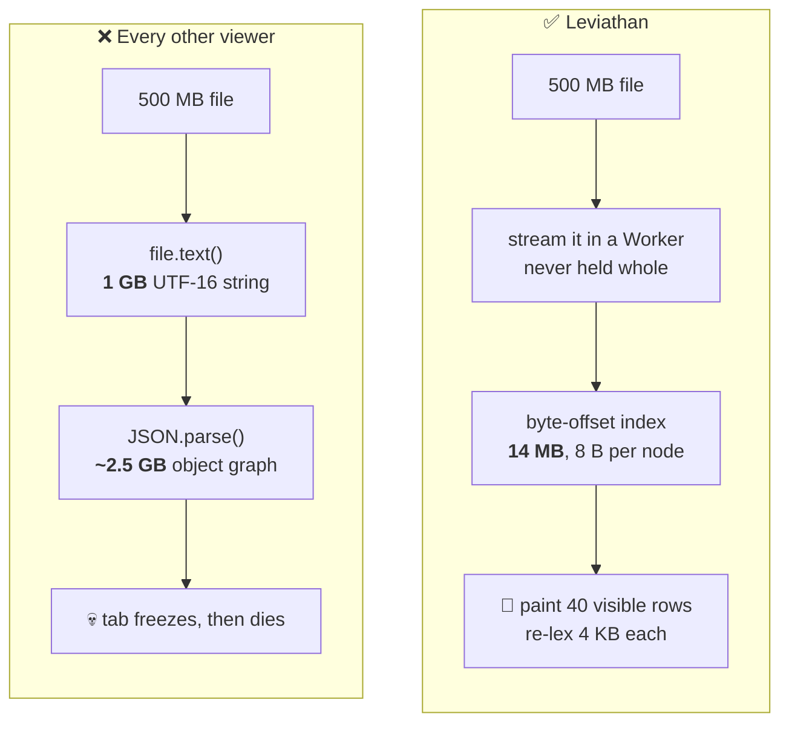
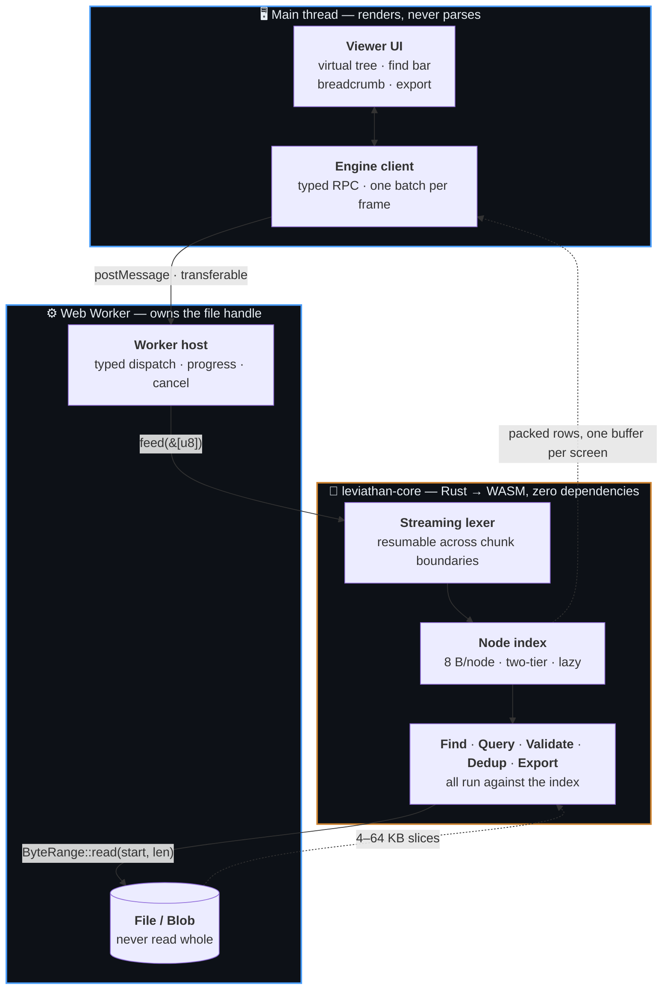
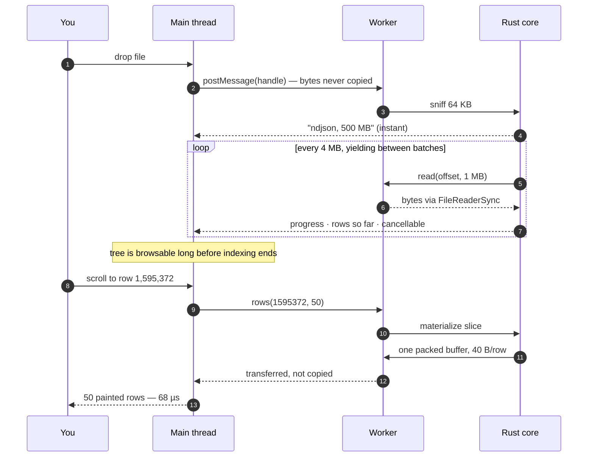

<div align="center">

# 🐋 Leviathan

**A JSON viewer that survives large files.**

Open multi-gigabyte JSON and NDJSON in your browser.
No freezing, no upload, no server.

[](https://github.com/shadkhan/leviathan/actions/workflows/ci.yml)
[](#license)
[](crates/leviathan-core)
[](#testing)

</div>

> [!WARNING]
> **Status: M2 in progress.** The engine is done and measured — streaming lexer,
> both index tiers, row materialization, the WASM boundary. The virtualized tree,
> the find bar and the keyboard UI are written and unit-tested but **have not yet
> been verified in a browser**. Not yet something you would install.
> See the [roadmap](#roadmap).

---

## The problem

Every JSON viewer in your browser does the same thing:

```js
JSON.parse(await file.text())   // ← the tab is now gone
```

`file.text()` holds the whole file as a UTF-16 string (**2×** its size), and
`JSON.parse` builds an object graph typically **3–10×** its size again. A 500 MB
file asks for several gigabytes on the main thread.



**Leviathan never parses the file into a value — it indexes it.** The index
stores only where things start. Key names, values and spans are re-derived by
re-lexing a few kilobytes at the moment a row is painted: microseconds each,
against hundreds of megabytes to store them.

## Features

| | Feature | Lands in |
|---|---|---|
| 📂 | **Load** — drag-and-drop, picker, folder, paste. JSON and NDJSON auto-detected | M2 |
| 🌲 | **View** — virtualized tree, breadcrumb, full keyboard navigation, dark mode | M2 |
| 🔍 | **Find** — literal search streamed over the *whole file*, not just what's on screen | M2 |
| ✅ | **Validate** — byte/line/column-accurate errors, jump to the break, JSON Schema | M3 |
| 🧭 | **Query** — JSONPath (RFC 9535) evaluated against the index, results streamed | M4 |
| 🧬 | **Dedup** — duplicate keys and elements, reported with both locations | M5 |
| 📤 | **Export** — JSON, NDJSON, CSV, or the current query result — streamed to disk | M6 |

Everything rides one engine. Nothing needs a server, an account, or a network.

**It survives broken files, too.** A truncated dump, one bad escape at 90 %
depth, a log rotation mid-record: every stage degrades instead of aborting —
partial index, markers in the tree, exports that write what they can. *"It won't
open"* is the failure mode of the tools this replaces.

## Who it's for

Large JSON is a specialist problem. These are the people who hit it.

| Persona | The moment they reach for it | What carries the load |
|---|---|---|
| 👩‍💻 **Priya** — Backend / API | A 300 MB API dump with one malformed record among 200,000 | Tree + find + JSONPath, without dropping to `jq` |
| 🛠️ **Rahul** — Data / ETL | 500 MB–2 GB NDJSON out of Kafka or BigQuery, before a load job | NDJSON auto-detection, validation, dedup |
| 🔬 **Sofia** — QA / Test | A pile of captured responses and one JSON Schema | "Does it conform, and *exactly* where does it break" |
| 🚨 **Marcus** — Platform / SRE | Mid-incident, inside a depth-20 Terraform or k8s state file | Fast deep navigation and subtree export |
| 🧩 **Aisha** — Integration dev | An unfamiliar third-party payload, learning its shape from a sample | Shape inference — *v1.5, not v1* |

The bar: **a tool that saves an engineer 40 minutes during an incident earns
permanent toolbar space.** Narrow and deep, not broad — see
[`USER_PERSONAS.md`](USER_PERSONAS.md).

## How it works



<details>
<summary><b>What actually happens when you drop a 500 MB file</b></summary>



</details>

Three rules hold it together, each enforced by something that *fails* rather
than by convention:

| Rule | Enforced by |
|---|---|
| Parsing never happens on the main thread | The Worker compiles with `lib: WebWorker` — the UI has no parser to call |
| The core stays portable and publishable | [`check-layering.sh`](scripts/check-layering.sh) fails CI on any wasm/IO dependency |
| The bundle stays small | [`build.mjs`](packages/extension/build.mjs) fails the build above 150 KB gz |

## Numbers

500 MB NDJSON fixture, 8 × x86_64, `bench-native` profile. Reproducible with
`leviathan bench`. Nothing here is an estimate; `—` means not yet built.

| Metric | Target | Naive `JSON.parse` | Leviathan |
|---|---|---|---|
| Tier-1 index build | — | ✗ crashes | **0.35 s** warm · 1.07 s cold |
| Index size | < 40 MB | n/a | **14.2 MB** — 2.8 % of the file ✅ |
| Peak memory, indexed | < 400 MB | ✗ crashes | **22 MB** ✅ |
| 50 rows from the middle | < 20 ms | ✗ crashes | **68 µs** warm · 132 µs cold ✅ |
| Same, 5 M-element array | < 20 ms | ✗ crashes | **65–119 µs** ✅ |
| Whole-file find | — | ✗ crashes | **466 ms** (1.1 GB/s) ✅ |
| Lex throughput | ≥ 200 MB/s | — | **248–327 MB/s** ✅ |
| Parse + validate | — | ✗ crashes | 216 MB/s |
| First rows painted (browser) | < 2 s | ✗ never | — |
| Index throughput (WASM) | ≥ 100 MB/s | — | — |

> **Opening a file is six times cheaper than parsing it.** NDJSON indexing scans
> for newlines and never parses — exact, not heuristic, because JSON forbids raw
> control characters in strings. It runs at 1.4 GB/s against a 1.2 GB/s
> newline-counting ceiling, while full parse-and-validate manages 216 MB/s.
>
> **One caveat published rather than buried:** 8 bytes per node is 2.8 % of a
> record-shaped file and ~80 % of a flat array of small scalars. That shape
> misses the criterion, two mitigations are identified, neither is built —
> [ADR-004](docs/adr/ADR-004-index-representation.md).

**Correctness**, not just speed:

| | |
|---|---|
| [JSONTestSuite](https://github.com/nst/JSONTestSuite) | **95/95** must-accept · **185/188** must-reject — [3 documented deviations](docs/adr/ADR-001-parser-strategy.md) |
| Fuzzing | **1,969,106,501 cases** in 30 min — 0 panics, 0 chunk-size disagreements |
| Determinism | The same fixture always yields 108,133,846 tokens and 1,772,686 records, at every chunk size |

The fuzzer checks *chunk invariance*, not just crashes: a resumable lexer's real
failure is giving different answers depending on where the boundary falls.

## Quick start

**Prerequisites:** [Rust](https://rustup.rs), [wasm-pack](https://rustwasm.github.io/wasm-pack/installer/),
[Node](https://nodejs.org) 22+, [pnpm](https://pnpm.io) 10+.

```sh
git clone https://github.com/shadkhan/leviathan
cd leviathan
pnpm install
pnpm build        # WASM package, then the extension
```

Load it in Chrome: `chrome://extensions` → **Developer mode** → **Load unpacked**
→ `packages/extension/dist`. `pnpm dev` rebuilds on change.

<details>
<summary><b>Testing</b></summary>

`pnpm check` runs everything. Individually:

| Command | Proves |
|---|---|
| `cargo test --workspace` | 280 tests: lexer, grammar, index, rows, expansion, conformance |
| `cargo test -p leviathan-core --test conformance` | RFC 8259 accept/reject, every case at three chunk sizes |
| `leviathan conformance [DIR]` | The full JSONTestSuite corpus; non-zero exit on any undocumented disagreement |
| `leviathan fuzz --seconds N` | Panics and chunk-boundary disagreements; reproducible from its seed |
| `bash scripts/check-layering.sh` | The core has no wasm/IO dependency and still builds for `wasm32` |
| `pnpm typecheck` | Both TS projects — UI (`lib: DOM`) and Worker (`lib: WebWorker`) |
| `pnpm build` | Bundles, and enforces the 150 KB gz budget (currently **14.8 KB**, 10 %) |

Not `cargo-fuzz`: it needs libFuzzer and nightly and does not support
`x86_64-pc-windows-msvc`, so rather than make an exit criterion
platform-conditional, the fuzzer uses the same seeded xorshift the fixtures do.
Still to land: criterion benches and Playwright end-to-end tests.

</details>

## The core is a standalone library

`leviathan-core` is **sans-IO** — it never opens a file, never awaits, and does
not know what a `Blob` is. Bytes are pulled through a trait you implement. It has
**zero dependencies**, which is why the same crate runs unchanged in a Worker, a
CLI, and (v2) an MCP server.

| Package | Registry | What it is |
|---|---|---|
| [`leviathan-core`](crates/leviathan-core) | crates.io | The engine. Pure Rust, no dependencies |
| [`@shadkhan/leviathan-core`](crates/leviathan-wasm) | npm | The same engine, as WASM + TypeScript types |
| `leviathan-cli` | crates.io | Native harness: benchmarks, fixtures, conformance, fuzzing |

## Roadmap

| | Milestone | Status |
|---|---|---|
| **M0** | Skeleton, WASM boundary, typed protocol, CI | ✅ |
| **M1** | Streaming lexer + node index ← *the make-or-break phase* | ✅ measured, conformant, fuzzed |
| **M2** | Virtual tree, navigation, find, trust indicators | 🔨 built, not yet browser-verified |
| **M3** | Validation: byte-accurate errors, jump-to-position, JSON Schema | ⬜ |
| **M4** | Query: JSONPath over the index | ⬜ |
| **M5** | Dedup: duplicate keys and elements | ⬜ |
| **M6** | Export: JSON / NDJSON / CSV, streamed | ⬜ |
| **M7** | Publish: crates.io + npm + Chrome Web Store | ⬜ |

v1 stops there. **Not in v1:** cloud sync, accounts, telemetry, JSON-LD/SEO
checking, an AI-agent surface, or editing.

## Privacy

Your data never leaves your machine, and you needn't take that on faith:

- The manifest requests **zero permissions** and **zero host permissions**
- The `.wasm` is bundled — MV3 forbids remote code, and nothing is fetched
- No analytics, no telemetry, no network code of any kind

Unzip the extension and check.

## Design documents

This repository is written to be read — the reasoning is checked in, not implied.

| Document | What it holds |
|---|---|
| [`USER_PERSONAS.md`](USER_PERSONAS.md) | Who hits the wall, and when |
| [`SPEC.md`](SPEC.md) | The phased build plan, with exit criteria per milestone |
| [`DEEP_REASONING.md`](DEEP_REASONING.md) | Every core concept, dated — what it rules out, how it was validated |
| [`docs/adr/`](docs/adr/) | One architectural decision each, with the rejected alternatives and what it cost |
| [`USER_MANUAL.md`](USER_MANUAL.md) | Installing, using, testing |

## License

Copyright © 2026 Shadab Khan. Dual-licensed under
[MIT](LICENSE-MIT) or [Apache-2.0](LICENSE-APACHE), at your option — the Rust
convention: MIT is short and permissive, Apache-2.0 adds the explicit patent
grant some organisations require before adopting a dependency. Offering both
means neither is a reason to say no.

Contributions are dual-licensed the same way unless you state otherwise.
